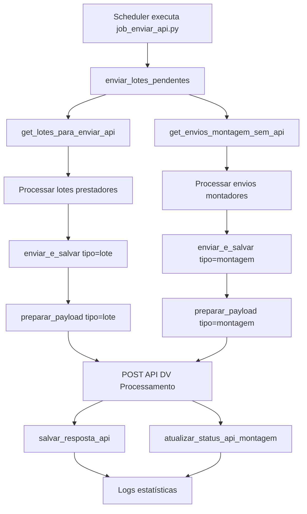

# Implementação API Montadores - Parte 1 ✅

## 📋 Resumo
Implementação da primeira etapa da integração do módulo de montadores com a API DV Processamento, permitindo envio de links de upload para montadores similar ao sistema de prestadores.

---

## ✅ O que foi implementado

### 1. **api_upload_client.py** - Cliente API Unificado

#### Modificações no método `preparar_payload()`
- ✅ Adicionado parâmetro `tipo='lote'` (valores: 'lote' ou 'montagem')
- ✅ Lógica condicional para processar prestadores OU montadores:
  
  **Para prestadores (tipo='lote'):**
  - Usa `prestador_nome` do lote
  - Busca email com `get_prestador_by_name()`
  - Conta OS com `get_os_by_lote_id()`
  - Usa `lote['id']` como identificador
  
  **Para montadores (tipo='montagem'):**
  - Usa `montador_nome` do envio
  - Busca email com `get_montador_by_name()`
  - Extrai `quantidade_os` do campo JSONB `detalhes`
  - Usa `envio['id']` como identificador

- ✅ Payload inclui campo `tipo` para identificação na API

#### Modificações no método `enviar_lote()`
- ✅ Adicionado parâmetro `tipo='lote'`
- ✅ Repassa tipo para `preparar_payload()`

#### Modificações no método `enviar_e_salvar()`
- ✅ Renomeado parâmetro `lote_id` → `item_id`
- ✅ Adicionado parâmetro `tipo='lote'`
- ✅ Busca dados de `lotes_servico` OU `envios_montagem` conforme tipo
- ✅ Validação de duplicatas adaptada para cada tipo
- ✅ Salva resposta usando:
  - `salvar_resposta_api()` para lotes (prestadores)
  - `atualizar_status_api_montagem()` para envios (montadores)

#### Nova função `enviar_lotes_pendentes()`
- ✅ Processa prestadores E montadores em um único job
- ✅ Busca pendentes com:
  - `get_lotes_para_enviar_api()` - prestadores
  - `get_envios_montagem_sem_api()` - montadores
- ✅ Estatísticas separadas:
  ```python
  {
      'total': 15,
      'lotes': {
          'total': 10,
          'sucesso': 9,
          'erro': 1,
          'detalhes': [...]
      },
      'montagens': {
          'total': 5,
          'sucesso': 5,
          'erro': 0,
          'detalhes': [...]
      }
  }
  ```
- ✅ Logs individualizados por tipo com emoji 📦 (lotes) e 🔧 (montagens)

---

### 2. **database.py** - Funções auxiliares

#### Nova função `get_montador_by_name(name)`
```python
def get_montador_by_name(name):
    """Busca montador pelo nome"""
    conn = get_db_connection()
    with conn.cursor(cursor_factory=psycopg2.extras.DictCursor) as cur:
        cur.execute('SELECT * FROM montadores WHERE nome = %s', (name,))
        montador = cur.fetchone()
    conn.close()
    return montador
```

#### Nova função `get_envio_montagem_by_id(envio_id)`
```python
def get_envio_montagem_by_id(envio_id):
    """Retorna envio de montagem pelo ID"""
    conn = get_db_connection()
    with conn.cursor(cursor_factory=psycopg2.extras.DictCursor) as cur:
        cur.execute('SELECT * FROM envios_montagem WHERE id = %s', (envio_id,))
        envio = cur.fetchone()
    conn.close()
    return envio
```

---

### 3. **job_enviar_api.py** - Job Unificado

#### Atualizações
- ✅ Documentação atualizada: "Enviar Lotes/Envios para API"
- ✅ Logs com estatísticas separadas:
  - Total geral
  - Lotes de prestadores (total, sucesso, erro)
  - Envios de montadores (total, sucesso, erro)
- ✅ Detalhamento individual com nome da empresa
- ✅ Exit code baseado em erros de ambos os tipos

#### Exemplo de saída de log:
```
📊 Processamento concluído:
   📦 Total geral: 15

   📦 Lotes de Prestadores:
      Total: 10
      ✅ Sucesso: 9
      ❌ Erro: 1

   🔧 Envios de Montadores:
      Total: 5
      ✅ Sucesso: 5
      ❌ Erro: 0

📝 Detalhes dos lotes de prestadores:
   ✅ Lote #32 (João Silva): Registro criado com sucesso
      🔗 Link: https://api.link.com.br/...
   
🔧 Detalhes dos envios de montadores:
   ✅ Envio #15 (Maria Santos): Registro criado com sucesso
      🔗 Link: https://api.link.com.br/...
```

---

## 🧪 Testes realizados

### Script de teste: `test_api_montadores.py`
- ✅ Verifica função `get_montador_by_name()` - **PASSOU**
- ✅ Lista envios pendentes com `get_envios_montagem_sem_api()` - **PASSOU**
- ✅ Simula preparação de payload para montadores - **PRONTO**

### Resultado:
```
🔍 Testando integração de montadores com API...

1️⃣ Testando get_montador_by_name...
   ✅ Função funciona (retornou: None)

2️⃣ Verificando envios de montadores pendentes...
   ℹ️  Encontrados 0 envios pendentes
   ⚠️  Nenhum envio pendente encontrado

✅ Teste concluído!
```

**Observação:** Não há envios de montagem cadastrados ainda, mas a estrutura está pronta e funcional.

---

## 📦 Estrutura de Dados

### Payload enviado para API (exemplo montadores):
```json
{
    "nome": "João Montador",
    "email": "joao@example.com",
    "periodo": "01/2025",
    "valor_total": 1500.00,
    "quantidade_os": 12,
    "data_envio": "2025-01-15T10:30:00",
    "lote_id": 42,
    "tipo": "montagem"
}
```

### Resposta da API esperada:
```json
{
    "success": true,
    "id_controle": 1234,
    "lote_id": 42,
    "link": "https://api.link.dev.br/dvprocessamento/envio-nf/abc123",
    "hash": "03de0449e11849318f7d67e08377f150",
    "validade_link": "2025-02-12",
    "status": 0,
    "message": "Registro criado com sucesso"
}
```

### Campos salvos em `envios_montagem`:
- `id_controle` - ID da API
- `link_upload` - URL para envio de NF
- `validade_link` - Data de expiração
- `status_api` - Status do registro (0 = criado, 1 = enviado)
- `upload_hash` - Hash de validação
- `data_ultima_consulta` - Última verificação de upload

---

## 🔄 Fluxo de execução



---

## 📝 Próximos passos (Parte 2)

### ⏳ Pendente: Consultar Notas (Download de arquivos)
- [ ] Criar/adaptar job para polling de uploads de montadores
- [ ] Baixar arquivos NF para `uploads/montagem_{id}/`
- [ ] Atualizar status com `atualizar_status_arquivo_montagem()`
- [ ] Salvar caminho com `salvar_nota_fiscal_montagem()`

### ⏳ Pendente: Interface Streamlit
- [ ] Adicionar seção "Envios de Montadores"
- [ ] Exibir link_upload, status_api, status_arquivo
- [ ] Botões para copiar link
- [ ] Download de notas fiscais recebidas

### ⏳ Pendente: Trello Integration
- [ ] Criar cards para montadores quando NF for recebida
- [ ] Anexar arquivos de `uploads/montagem_{id}/`
- [ ] Usar `montador_nome` no título do card

---

## ✅ Arquivos modificados

1. **api_upload_client.py** (149 linhas modificadas)
   - `preparar_payload()` - suporte a montadores
   - `enviar_lote()` - parâmetro tipo
   - `enviar_e_salvar()` - lógica unificada
   - `enviar_lotes_pendentes()` - processamento dual

2. **database.py** (18 linhas adicionadas)
   - `get_montador_by_name()` - nova função
   - `get_envio_montagem_by_id()` - nova função

3. **job_enviar_api.py** (45 linhas modificadas)
   - Logs com estatísticas separadas
   - Exit code agregado

4. **test_api_montadores.py** (novo arquivo)
   - Script de testes de integração

---

## 🎯 Status da migração

```
✅ PARTE 1 - Envio para API (CONCLUÍDO)
⏳ PARTE 2 - Consulta de Notas (PENDENTE)
⏳ PARTE 3 - Interface Streamlit (PENDENTE)
⏳ PARTE 4 - Trello Integration (PENDENTE)
⏳ PARTE 5 - Testes End-to-End (PENDENTE)
```

---

## 📚 Referências
- **Documentação:** MIGRACAO_MONTADORES_API.md
- **Estrutura DB:** Migrações em database.py (linhas 680-780)
- **Funções auxiliares:** database.py (linhas 780-820)

---

**Data de implementação:** 15/01/2025  
**Desenvolvedor:** GitHub Copilot + David Gabriel  
**Status:** ✅ Parte 1 concluída com sucesso
