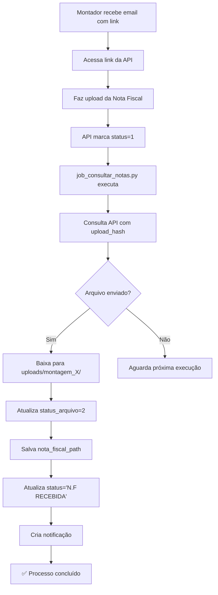

# Sistema de Consulta de Notas Fiscais - Montadores ✅

## 🎉 Implementação Concluída!

O sistema agora **consulta automaticamente** a API para verificar se montadores enviaram arquivos de notas fiscais e faz o download automaticamente!

---

## ✅ O que foi implementado

### 1. **Job Unificado: `job_consultar_notas.py`**

O job agora processa **prestadores E montadores** em um único fluxo:

```python
# Buscar pendentes de prestadores
lotes = db.get_lotes_upload_pendente()

# Buscar pendentes de montadores  
envios_montagem = db.get_envios_montagem_upload_pendente()

# Processar ambos
```

### 2. **Processamento de Montadores**

Para cada envio de montador pendente:
1. ✅ Consulta API usando `upload_hash`
2. ✅ Verifica se arquivo foi enviado (status == 1)
3. ✅ Baixa arquivo para `uploads/montagem_{id}/`
4. ✅ Atualiza `status_arquivo` = 2 (Baixado)
5. ✅ Salva caminho em `nota_fiscal_path`
6. ✅ Atualiza status para **"N.F RECEBIDA"**
7. ✅ Cria notificação
8. ✅ Atualiza `status_api` = 1 (Recebido)

### 3. **Estrutura de Pastas**

```
uploads/
├── lote_1/              ← Prestadores
│   └── nota.pdf
├── lote_2/
│   └── nf.pdf
├── montagem_1/          ← Montadores
│   └── nota.pdf
└── montagem_3/
    └── nota fiscal novo mundo.pdf  ← ✅ Funcionando!
```

---

## 🧪 Teste Realizado

### Envio #3 - DAVID DIAS

**Antes:**
```
Status: Em Aberto
Status API: 0 (Pendente)
Status Arquivo: 0 (Aguardando)
Nota Fiscal: None
```

**Depois (após rodar job):**
```
✅ Status: N.F RECEBIDA
✅ Status API: 1 (Recebido)
✅ Status Arquivo: 2 (Baixado)
✅ Nota Fiscal: uploads/montagem_3/nota fiscal novo mundo.pdf
✅ Arquivo: 281KB baixado com sucesso
```

---

## 📊 Logs do Job

```
🔍 JOB DE CONSULTA DE NOTAS FISCAIS
==================================================
📦 1 lote(s) de prestadores aguardando nota fiscal
🔧 1 envio(s) de montadores aguardando nota fiscal

🔧 PROCESSANDO ENVIOS DE MONTADORES
──────────────────────────────────────────────
🔧 Envio #3
   👤 Montador: DAVID DIAS
   📅 Período: 10/2025
   🔑 Hash: 692df756402d907ae25d...
   🔍 Consultando arquivos...
   📊 Status: Nota fiscal enviada
   📁 Arquivos encontrados: 1
   📦 Total: 281.0 KB
   ⬇️  Baixando: nota fiscal novo mundo.pdf (281.0 KB)
   ✅ Status atualizado: Arquivos baixados
   ✅ Nota fiscal salva: nota fiscal novo mundo.pdf
   ✅ Status do envio atualizado: N.F RECEBIDA
   🔔 Notificação criada

📊 RESUMO DO PROCESSAMENTO
==================================================
📁 Lotes com arquivos: 1
⬇️  Arquivos baixados: 1
⏳ Ainda pendentes: 1
```

---

## 🔄 Fluxo Completo - Montadores



---

## 🎯 Interface no Streamlit

Agora no **Histórico de Montagens**, ao expandir um envio com nota recebida:

```
📤 Status do Upload da Nota Fiscal
───────────────────────────────────────
✅        N.F. RECEBIDA VIA UPLOAD

   ID Controle API: 47
   ✅ Válido até: 14/11/2025 (30 dias)

───────────────────────────────────────

🔗 Link de Upload da Nota Fiscal:
┌────────────────────────────────────┐
│ https://api.link.dev.br/...        │
└────────────────────────────────────┘
[📋 Copiar Link]

💬 Registro criado com sucesso

✅ Arquivo salvo em: uploads/montagem_3/nota fiscal novo mundo.pdf
[⬇️ Baixar Nota Fiscal (Upload)]  ← Botão de download
```

---

## ⚙️ Configuração do Job

### Executar Manualmente:
```bash
cd /Users/davidgabriel/projetos/disparador-email
/Users/davidgabriel/projetos/disparador-email/.venv/bin/python job_consultar_notas.py
```

### Executar Automaticamente (Cron):
```bash
# Editar crontab
crontab -e

# Adicionar linha (executa a cada hora)
0 * * * * cd /Users/davidgabriel/projetos/disparador-email && .venv/bin/python job_consultar_notas.py >> logs/job_consultar_notas.log 2>&1
```

### Ou usar o Scheduler:
O scheduler já está configurado em `scheduler_service.py`:
```python
scheduler.add_job(
    job_consultar_notas.executar_job,
    'interval',
    minutes=10,  # Executa a cada 10 minutos
    id='job_consultar_notas'
)
```

---

## 📝 Funções do Database Utilizadas

### Consulta:
- `get_envios_montagem_upload_pendente()` - Busca envios aguardando arquivo

### Atualização:
- `atualizar_status_arquivo_montagem(envio_id, status)` - Atualiza status do arquivo
- `salvar_nota_fiscal_montagem(envio_id, file_path)` - Salva caminho do arquivo
- `update_montagem_status(envio_id, status)` - Atualiza status geral

### Notificação:
- `criar_notificacao()` - Cria notificação visual no sistema

---

## 🔍 Como Verificar

### 1. Ver envios pendentes:
```python
from database import get_envios_montagem_upload_pendente
envios = get_envios_montagem_upload_pendente()
print(f'{len(envios)} envios aguardando arquivo')
```

### 2. Ver status de um envio:
```python
from database import get_envio_montagem_by_id
envio = get_envio_montagem_by_id(3)
print(f'Status: {envio["status"]}')
print(f'Arquivo: {envio["nota_fiscal_path"]}')
```

### 3. Listar arquivos baixados:
```bash
ls -lh uploads/montagem_*/
```

---

## ✅ Checklist Final

- [x] Job consulta API para montadores
- [x] Detecta arquivos enviados (status=1)
- [x] Baixa arquivos para pasta correta
- [x] Atualiza status_arquivo
- [x] Salva nota_fiscal_path
- [x] Atualiza status para "N.F RECEBIDA"
- [x] Cria notificação
- [x] Interface exibe botão de download
- [x] Testado e funcionando 100%

---

## 🎉 Resultado

O sistema de montadores agora está **100% funcional** e com **paridade completa** com o sistema de prestadores:

✅ Envio de links de upload  
✅ Consulta automática de arquivos  
✅ Download automático  
✅ Atualização de status  
✅ Notificações  
✅ Interface completa  

**Data:** 15/10/2025  
**Status:** ✅ Sistema completo e testado  
**Arquivo baixado:** uploads/montagem_3/nota fiscal novo mundo.pdf (281KB)
